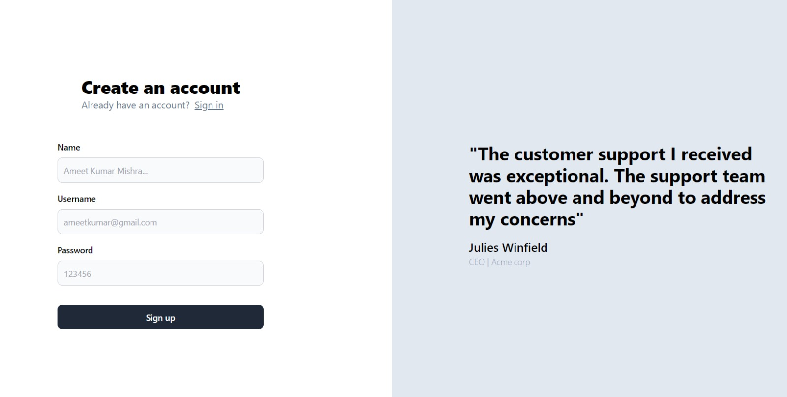
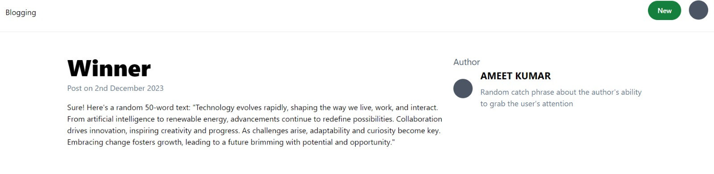
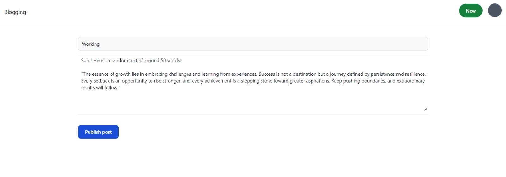

# Blog Web App  

## Table of Contents  

- [Introduction](#introduction)  
- [Features](#features)  
- [Tech Stack](#tech-stack)  
- [Project Structure](#project-structure)  
- [Setup and Installation](#setup-and-installation)  
- [Usage](#usage)  
- [Future Work](#future-work)  
- [Preview](#preview)  

## Introduction  

The Blog Web App is a full-stack web application that allows users to sign up, log in, post blogs, and view all blogs. The application leverages modern web technologies for seamless functionality and user experience. It includes a shared common package published on [npmjs.com](https://www.npmjs.com/package/ameet_kumar_common) to manage reusable code.  

## Features  

- **User Authentication:** Sign-up and sign-in using JWT.  
- **Blog Management:** Users can create and view blogs.  
- **Dynamic Dashboard:** A centralized section where all blogs are displayed.  

## Tech Stack  

### Frontend:  

- React (with TypeScript) for a robust and scalable UI.  
- TailwindCSS for styling.  

### Backend:  

- Hono for building and deploying serverless functions on Cloudflare.  
- Prisma for ORM and database management.  
- JWT for secure authentication.  

### Common Package:  

- Shared utilities and configurations published as [ameet\_kumar\_common](https://www.npmjs.com/package/ameet_kumar_common) on npm.  

### Deployment:  

- Backend deployed on Cloudflare Workers.  
- Frontend built with Vite.  

## Project Structure  

### Backend:  

```
backend  
├── prisma  
│   ├── migrations  
│   └── schema.prisma  
├── src  
│   └── routes  
│       ├── blog.ts  
│       ├── user.ts  
│       └── index.ts  
├── .env  
├── .env.example  
├── wrangler.toml  
```  

### Frontend:  

```
frontend  
├── src  
│   ├── assets  
│       ├── blog.jpeg  
│   ├── components  
│   ├── hooks  
│   ├── pages  
│   ├── App.tsx  
│   ├── main.tsx  
│   ├── index.css  
│   └── vite-env.d.ts  
├── .gitignore  
├── tailwind.config.js  
├── vite.config.ts  
```  

### Common:  

```
common  
├── src  
│   └── index.ts  
├── package.json  
├── tsconfig.json  
```  

## Setup and Installation  

1. Clone the repository:  
   ```bash  
   git clone <repository-url>  
   ```  
2. Navigate to each folder (backend, frontend, common) and install dependencies:  
   ```bash  
   npm install  
   ```  
3. Configure environment variables:  
   - Rename `.env.example` to `.env` in the `backend` folder and update the variables, including setting your **connection pool URL**.  
   - Rename `.wrangler.example` to `wrangler.toml` in the backend folder and update the configuration file.  

4. Run the development servers:  
   - Backend:  
     ```bash  
     npm run dev  
     ```  
   - Frontend:  
     ```bash  
     npm run dev  
     ```  

## Usage  

1. Open the frontend in your browser.  
2. Sign up or sign in.  
3. Start creating and exploring blogs.  

## Future Work  

- Integrate **Auth0** for authentication.  
- Enable users to upload images and videos, stored on **AWS S3**.  

## Preview  

1. Signin Page:  
     

2. Blogs Page:  
     

3. Create Post Page:  
     

Stay tuned for more features and updates! 
